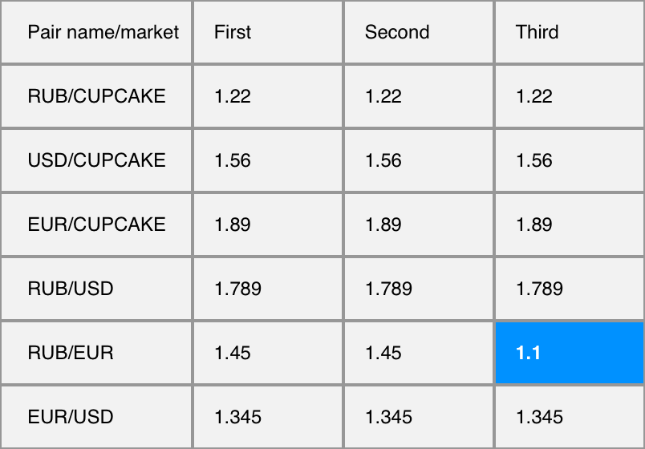

## Тестовое задание для Cupcake Development

### Суть задания

Необходимо в реальном времени отображать значение валютных пар RUB/CUPCAKE, USD/CUPCAKE, EUR/CUPCAKE, RUB/USD, RUB/EUR, EUR/RUB. Эндпоинт */poll резолвится в тот момент когда появляются новые данные, смотри - лонг поллинг. Так же необходимо подсветить самые выгодные(наименьшее значение по строке). В качестве фронтенд фреймворка необходимо использовать React. Другие библиотеки для работы с данными - на Ваше усмотрение.



### Api

[Локальный Api](https://bitbucket.org/cupcakedev/cupcake-frontend-test-task/src/master/)

### Использованные инструменты

Проект был создан с использованием [Create React App](https://github.com/facebook/create-react-app) и библиотеки [axios](https://github.com/axios/axios).

### Команды

```bash
# Установка зависимостей
$ yarn install

# Запуск на http://localhost:3010/
$ yarn start

# Сборка
$ yarn build
```
